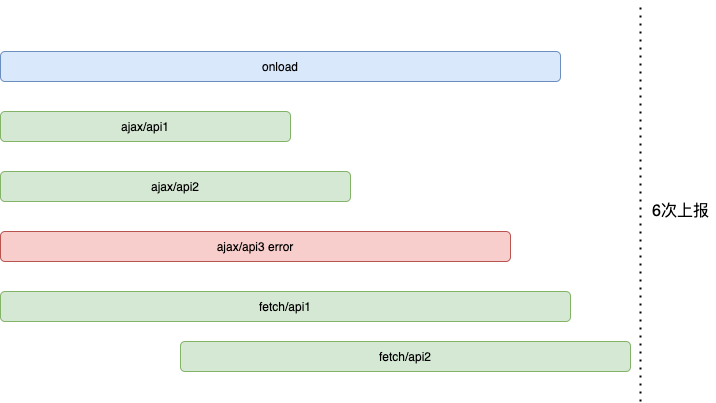
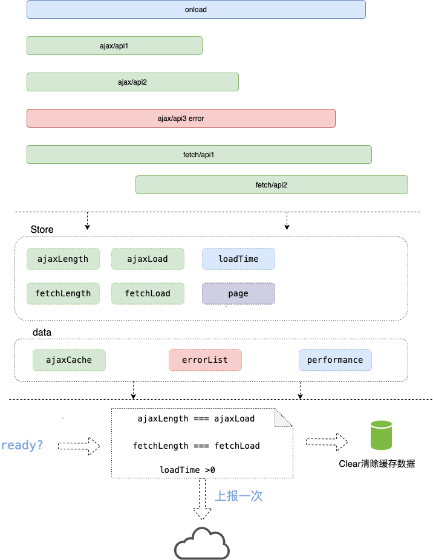

import TOCInline from "@theme/TOCInline";
import { Image, Card, Alert, Divider } from "antd";
import errorImg from "../assets/athena-error.jpg";
import performImg from "../assets/window.performance.timing.png";
import archImg from "../assets/arch-sdk.png";
import apiImg from "./API.jpg";
import xhrMethodImg from "../assets/xhr-method.jpg";
import fetchImg from "../assets/fetch.jpg";
import XMLHttpRequestImg from "../assets/XMLHttpRequest.jpg";
import XHRHooksImg from "../assets/XHR-HOOKS.jpg";

import "antd/dist/antd.css";

import Tabs from "@theme/Tabs";
import TabItem from "@theme/TabItem";

Hello 大家好~~，今天给大家带来的分享是关于如何从零实现一个前端监控 SDK,（前段时间参与了性能监控平台的共建，有一些自己的心得，故此分享出来，共同进步）

接下来我将通过以下几个步骤带大家完成前端监控 SDK

<TOCInline toc={toc} />

### 一、 为什么要做前端监控，都需要监控什么？

#### 场景：

1. 客户手机端白屏了，系统无法使用，直到领导找到你，你紧张的汗都下来了，焦急的查着代码，但没有头绪
2. 点击某个按钮在手机端的执行逻辑存在兼容性，而你缺不知道，导致部分客户流失
3. 接口请求耗时较多，用户体验差，我们却全然不知

#### 都需要做哪些监控

- ✏️ 前端错误
- 🔧 页面性能
- ✏️ API 性能

**知道了为什么要做监控，以及要监控 什么，那么我们接下来看要要如何实现，各类监控呢**

<Divider />

### 二、 如何实现各类监控？

#### 1、前端错误监控

<Image width={"100%"} src={errorImg} />

<p>如上图所示，前端错误捕获方式，主要分为以上四大类，</p>
<span style={{ fontSize: "20px", color: "#9A0680" }}>第一种</span>
是我们经常会遇到过的 JS 运行时错误， 一般我们采用 window.onerror
方法就可以对其进行捕获，该方法会返回 5 个参数，分别是，

- message：错误信息（字符串）。可用于 HTML onerror=""处理程序中的 event。
- source：发生错误的脚本 URL（字符串）
- lineno：发生错误的行号（数字）
- colno：发生错误的列号（数字）
- error：Error 对象（对象）

另种运行时错误是用户利用 console.error 打印出来的我们也要进行拦截捕获。

<p>
  <span style={{ fontSize: "20px", color: "#9A0680" }}>第二种</span>{" "}
  是页面中资源（诸如图片img,脚本script）加载错误，找不到资源啦，资源加载超时啦，可以通过
  window.addEventListener('error', function(event) {}) 进行捕获，返回的event
  中，包含
</p>

- localName 资源名称
- type 资源类型
- src 资源源地址

<p>
  <span style={{ fontSize: "20px", color: "#9A0680" }}>第三种</span>
  是当Promise 被 reject 且没有 reject 处理器的时候，会触发 unhandledrejection 事件。可以通过
  window.addEventListener('unhandledrejection', function(event) {}) 进行捕获，返回的event
  中，包含
</p>

- reason reject 的原因

<p>
  <span style={{ fontSize: "20px", color: "#9A0680" }}>第四种</span>
  是异步请求的错误，浏览器中发送ajax 请求共有两种方式分别是 XMLHttpRequest 和 Fetch,
  所以相应的也分两种捕获类型。
</p>

- 对于 XHR 我们可以通过监听它的 onerror 事件来捕获异常错误，通过监听 onabort
  事件来监听中断请求异常，如果请求顺利返回，我们通过判断返回的状态码 status 是否是小于 200
  或者大于等于 300 来判断这次请求是否失败。
- 对于 Fetch 来说，我们可以通过重写 catch 方法来获得发生的错误，或者判断返回的 response.ok
  是否为 false 来进行错误上报

#### 2、页面性能监控

<Image width={"100%"} src={performImg} />

<Paragraph>
  如上图所示，当页面load 之后我们通过调用window 上的performance.timing
  对象上的相关属性进行计算，就可以获得我们想要的相关时间
</Paragraph>

#### 3、API 性能监控

<Image width={"100%"} src={apiImg} />
如上图所示，我们先来看
<p>
  <span style={{ fontSize: "20px", color: "#9A0680" }}>第一种</span>
  情况，通过重写XMLHttpRequest对象的实现逻辑来达到监听，我们首先通过重写open 属性来进行注册请求基本信息，然后重写，onreadystatechange,onload,和onloaded
  来监听请求成功返回， 接下来看
</p>
<p>
  <span style={{ fontSize: "20px", color: "#9A0680" }}> 第二种</span>
  情况Fetch,通过监听then 方法返回的response ,来获取status 和 获取响应大小
</p>

#### 上报时机的思考

:::info 思考题

<p>1、我们每次上报都需要发送请求吗？</p>
<p>2、如果需要进行合并，如何进行上报合并呢？</p>

:::

**优化前：**



:::tip 解决方案

<p>1、上报场景分为两类，初始化页面时，和后续ajax 操作</p>
<p>
  2、初始化页面：对ajax 请求，错误信息，分别进行缓存，在一定时间内，直到所有ajax
  请求 都完成以及页面load，才进行整体上报
</p>
<p>
  3、后续ajax 操作：对ajax
  请求，错误信息，分别进行缓存，在一定时间内，直到所有ajax 请求
  都完成，才进行整体上报
</p>

:::

**优化后：**



### 三、 数据的上报和收集

**首先上报方式分为两大类**

- SDK 监听特定事件，进行上报
- 用户通过自己的技术手段（例如 try,catch，React ErrorBoundary ）,通过调用 athena.addError(ErrorOptions); 来上报

**上报类型分为三大类**

1. PAGE = 1 //页面级性能上报

2. AJAX = 2 //页面 API 性能上报

3. ERROR = 3 //页面内错误信息上报

:::info

接下来我们就针对**具体场景**进行分析

:::

#### 场景一：页面级性能上报

<Tabs>
<TabItem value="apple" label="上报方式" default>

<Card
  title="通过监听 load事件（标识页面资源已经加载完成）来进行上报，
  以及将相关静态资源进行上报"
>
  <p> 🍎 1、 performance.timing</p>
  <p> 🥔 2、 performance.getEntriesByType('resource')</p>
</Card>

</TabItem>

<TabItem value="orange" label="关键代码解析">

```javascript
window.addEventListener("load", onLoadEvent, false);
const onLoadEvent = function () {
  reportToLanding(REPORT_TYPE.PAGE);
};
function reportToLanding({ type }) {
  const resourceList = filterResource(options.filterUrl || [], options);
  const performance = performPage();

  const params = extend(true, params, {
    preUrl:
      document.referrer && document.referrer !== window.location.href
        ? document.referrer
        : "",
    performance: performPage(),
    resourceList: resourceList,
  });
  // 开始上报

  window.fetch(options.domain, {
    method: "POST",
    headers: { "Content-Type": "application/json" },
    report: true,
    body: jsonToString(params),
  });
}

export function performPage() {
  if (!window.performance) return;
  let timing = window.performance.timing;
  return {
    dnst: timing.domainLookupEnd - timing.domainLookupStart || 0, // DNS解析时间
    tcpt: timing.connectEnd - timing.connectStart || 0, // TCP建立时间
    wit: timing.responseStart - timing.navigationStart || 0, // 白屏时间
    domt: timing.domContentLoadedEventEnd - timing.navigationStart || 0, // dom渲染完成时间
    lodt: timing.loadEventEnd - timing.navigationStart || 0, // 页面onload时间
    radt: timing.fetchStart - timing.navigationStart || 0, // 页面准备时间
    rdit: timing.redirectEnd - timing.redirectStart || 0, // 页面重定向时间
    uodt: timing.unloadEventEnd - timing.unloadEventStart || 0, // unload时间
    reqt: timing.responseEnd - timing.requestStart || 0, // request请求耗时
    andt: timing.domComplete - timing.domInteractive || 0, // 页面解析dom耗时
  };
}
export function filterResource(filterList: any[], options: OptionsTypes) {
  const resourceList: any[] = performResource(options);

  return resourceList.filter((item: any) => {
    return (
      filterList.filter((filterUrl: any) => {
        return item.name.indexOf(filterUrl) > -1;
      }).length === 0
    );
  });
}
function performResource(options: OptionsTypes) {
  if (!window.performance || !window.performance.getEntries) return [];
  let resource: any[] = window.performance.getEntriesByType("resource");
  let resourceList: any[] = [];
  if (!resource || resource.length === 0) return resourceList;
  resource.forEach((item) => {
    if (
      !options.isAjax &&
      (item.initiatorType === "xmlhttprequest" ||
        item.initiatorType === "fetchrequest")
    )
      return;
    if (
      !options.isResource &&
      item.initiatorType !== "xmlhttprequest" &&
      item.initiatorType !== "fetchrequest"
    )
      return;
    const specification = {
      name: item.name,
      method: "GET",
      type: item.initiatorType,
      duration: item.duration.toFixed(2) || 0,
      decodedBodySize: item.decodedBodySize || 0,
      nextHopProtocol: item.nextHopProtocol,
      options: "",
    };
    const url = item.name ? item.name.split("?")[0] : "";
    // ------>TODO
    const ajaxCache = store.ajaxCache[url] || "";
    if (ajaxCache) {
      specification.method = ajaxCache.method || "GET";
      specification.type = ajaxCache.type || specification.type;
      specification.decodedBodySize =
        specification.decodedBodySize || ajaxCache.decodedBodySize;
      specification.options = ajaxCache.options;
    }
    resourceList.push(specification);
  });

  return resourceList;
}
```

</TabItem>
</Tabs>

#### 场景二：页面错误上报

<Tabs>
  <TabItem value="apple" label="上报方式" default>

  <Card title="通过监听一系列全局事件">
    <p>🍎  1、 利用 window.addEventListener('error', listenErrorEvent, true); 捕获 img,script,css,jsonp
    相关错误
    </p>
    <p> 🍌  2、 重写 window.onerror 用于捕获运行时错误</p>
    <p>
    🍇  3、 当 Promise 被 reject 且没有 reject 处理器的时候，会触发 unhandledrejection
    事件。window.addEventListener('unhandledrejection', unhandledrejectionEvent);
    </p>
    <p> 🍉  4、 重写console.error 方法调用</p>

  </Card>

  </TabItem>
  <TabItem value="orange" label="关键代码解析">

<Alert message="1、资源错误" type="info" showIcon />

```javascript
window.addEventListener("error", listenErrorEvent, true);
const mechanicsError = { t: "", n: "js", msg: "", data: {} };
const listenErrorEvent = function (ex: any) {
  let reportParams = extend(true, {}, mechanicsError);
  reportParams.n = "resource";
  reportParams.t = new Date().getTime();
  reportParams.msg = ex.target.localName + " is load error";
  reportParams.method = "GET";
  reportParams.data = {
    target: ex.target.localName,
    type: ex.type,
    resourceUrl: ex.target.href || ex.target.src,
  };
  if (ex.target !== window) {
    store.errorList.push(reportParams);
    setTimeout(() => {
      reportToLanding(REPORT_TYPE.ERROR);
    }, ErrorReportDelayTime);
  }
};
```

<Alert message="2、js运行时错误" type="success" showIcon />

```javascript
window.onerror = onErrorEvent;
const onErrorEvent = function (
  msg: any,
  _url: any,
  line: any,
  col: any,
  error: any
) {
  let reportParams = extend(true, {}, mechanicsError);

  reportParams.msg = error && error.stack ? error.stack.toString() : msg;
  reportParams.method = "GET";
  reportParams.data = {
    resourceUrl: _url,
    line: line,
    col: col || 0,
  };
  reportParams.t = new Date().getTime();
  store.errorList.push(reportParams);
  setTimeout(() => {
    reportToLanding(REPORT_TYPE.ERROR);
  }, ErrorReportDelayTime);
};
```

<Alert message="3、未处理的Promise 的reject" type="warning" showIcon />

```javascript
window.addEventListener("unhandledrejection", unhandledrejectionEvent);
const unhandledrejectionEvent = function (ex: any) {
  try {
    const error = ex && ex.reason;
    const message = error.message || "";
    const stack = error.stack || "";
    // Processing error
    let resourceUrl, col, line;
    let errs = stack.match(/\(.+?\)/);
    if (errs && errs.length) errs = errs[0];
    errs = errs?.replace(/\w.+[js|html]/g, ($1: any) => {
      resourceUrl = $1;
      return "";
    });
    errs = errs?.split(":");
    if (errs && errs.length > 1) line = parseInt(errs[1] || 0);
    col = parseInt(errs[2] || 0);
    let reportParams = extend(true, {}, mechanicsError);
    reportParams.msg = message || error;
    reportParams.method = "GET";
    reportParams.n = "unhandledrejection";
    reportParams.t = new Date().getTime();
    reportParams.data = {
      resourceUrl: resourceUrl,
      line: line,
      col: col,
      stack: stack,
    };
    store.errorList.push(reportParams);
    setTimeout(() => {
      reportToLanding(REPORT_TYPE.ERROR);
    }, ErrorReportDelayTime);
  } catch (ex) {
    console.warn("athena", ex);
  }
};
```

<Alert message="4、重写console.error" type="error" showIcon />

```javascript
console.error = rewriteConsoleError();
 const rewriteConsoleError = function() {
    const originalError = console.error;
    return function(args1: any, args2: any, args3: any) {
      const reportParams = extend(true, {}, mechanicsError);
      reportParams.msg = [args1, args2, args3].join('/');
      reportParams.method = 'GET';

      reportParams.t = new Date().getTime();
      reportParams.data = {
        resourceUrl: window.location.href,
        stack: args1?.stack || args1?.message,
      };
      store.errorList.push(reportParams);

      setTimeout(() => {
        reportToLanding(REPORT_TYPE.ERROR);
      }, ErrorReportDelayTime);
      return originalError.apply(console, arguments as any);
    };
  };
```

</TabItem>

</Tabs>

#### 场景三：XMLHttpRequest 性能和错误上报

<Tabs>
  <TabItem value="apple" label="上报方式" default>
    <Card title="通过重写XMLHttpRequest 对象">
    <p>🍎  1、 利用 window.realXhr = XMLHttpRequest; 缓存原始XMLHttpRequest对象
    </p>
    <p> 🍌  2、 重写 XMLHttpRequest 对象创建过程， </p>
    <p>
    🍇  3、 重写方法 overwriteMethod ，重写属性 overwriteAttributes
    </p>

  </Card>

XHR 相关事件

<Image width={"100%"} src={xhrMethodImg} />

XHR 重写流程图

<Image width={"100%"} src={XMLHttpRequestImg} />

Hooks 示意图

<Image width={"100%"} src={XHRHooksImg} />

  </TabItem>
  <TabItem value="orange" label="关键代码解析">

```javascript
    window.realXhr = XMLHttpRequest;
    const hooks = getHooks(reportToLanding, options);
    //@ts-ignore
    XMLHttpRequest = function(this: ProxyXHRType) {
      this._xhr = new window.realXhr();
      for (let attr in this._xhr) {
        let type: string = '';
        try {
          type = typeof this._xhr[attr as XHRField];
        } catch (e) {}
        if (type === 'function') {
          overwriteMethod(attr as XHRField, this, hooks);
        } else {
          overwriteAttributes(attr as XHRField, this, hooks);
        }
      }
    };

const getHooks = (reportToLanding: any, options: OptionsTypes): any => {
  const ajaxResponse = getAjaxResponse(reportToLanding);
  return {
    onreadystatechange: function(proxyXHR: ProxyXHRType) {
      if (proxyXHR.readyState === 4) {
        if ([AjaxStateType.LOADED, AjaxStateType.LOAD].includes(proxyXHR.ajaxStateType)) return;
        proxyXHR.ajaxStateType = AjaxStateType.READYCHANGE;
        const responseURL = proxyXHR._xhr.responseURL ? proxyXHR._xhr.responseURL.split('?')[0] : '';
        if (store.ajaxCache[responseURL]) {
          try {
            if (proxyXHR.response instanceof Blob) {
              store.ajaxCache[responseURL]['decodedBodySize'] = proxyXHR._xhr.response.size;
            } else {
              store.ajaxCache[responseURL]['decodedBodySize'] = proxyXHR._xhr.responseText.length;
            }
            store.ajaxCache[responseURL]['options'] = {
              resourceUrl: proxyXHR._xhr.responseURL,
              text: proxyXHR._xhr.statusText,
              status: proxyXHR._xhr.status,
            };
          } catch (err) {}
        }

        // 错误上报
        if (proxyXHR.status < 200 || proxyXHR.status > 300) {
          ajaxResponse(proxyXHR, { method: proxyXHR.args.method });
        } else {
          // 成功后上报
          store.ajaxLoad += 1;
          setTimeout(() => {
            reportToLanding(REPORT_TYPE.AJAX);
          }, AjaxReportDelayTime);
        }
      }
    },
    onerror: function(proxyXHR: ProxyXHRType) {
      const params: any = {};
      if (proxyXHR.args) {
        params.method = proxyXHR.args.method;
        params.responseURL = proxyXHR.args.url;
        params.statusText = 'ajax request error';
      }

      ajaxResponse(proxyXHR, params);
    },
    onabort: function(proxyXHR: ProxyXHRType) {
      const params: any = {};
      if (proxyXHR.args) {
        params.method = proxyXHR.args.method;
        params.responseURL = proxyXHR.args.url;
        params.statusText = 'ajax aborted error';
      }

      ajaxResponse(proxyXHR, params);
    },
    onload: function(proxyXHR: ProxyXHRType) {
      if (proxyXHR.readyState === 4) {
        if ([AjaxStateType.LOADED, AjaxStateType.READYCHANGE].includes(proxyXHR.ajaxStateType)) return;
        proxyXHR.ajaxStateType = AjaxStateType.LOAD;
        const responseURL = proxyXHR._xhr.responseURL ? proxyXHR._xhr.responseURL.split('?')[0] : '';
        if (store.ajaxCache[responseURL]) {
          try {
            if (proxyXHR._xhr.response instanceof Blob) {
              store.ajaxCache[responseURL]['decodedBodySize'] = proxyXHR._xhr.response.size;
            } else {
              store.ajaxCache[responseURL]['decodedBodySize'] = proxyXHR._xhr.responseText.length;
            }
            store.ajaxCache[responseURL]['options'] = {
              resourceUrl: proxyXHR._xhr.responseURL,
              text: proxyXHR._xhr.statusText,
              status: proxyXHR._xhr.status,
            };
          } catch (err) {}
        }

        if (proxyXHR.status < 200 || proxyXHR.status > 300) {
          // 发生错误

          // 错误上报
          ajaxResponse(proxyXHR, { method: proxyXHR.args.method });
        } else {
          // 成功后上报
          store.ajaxLoad += 1;
          setTimeout(() => {
            reportToLanding(REPORT_TYPE.AJAX);
          }, AjaxReportDelayTime);
        }
      }
    },
    onloadend: function(proxyXHR: ProxyXHRType) {
      if (proxyXHR.readyState === 4) {
        if ([AjaxStateType.LOAD, AjaxStateType.READYCHANGE].includes(proxyXHR.ajaxStateType)) return;
        proxyXHR.ajaxStateType = AjaxStateType.LOADED;
        const responseURL = proxyXHR._xhr.responseURL ? proxyXHR._xhr.responseURL.split('?')[0] : '';
        if (store.ajaxCache[responseURL]) {
          try {
            if (proxyXHR._xhr.response instanceof Blob) {
              store.ajaxCache[responseURL]['decodedBodySize'] = proxyXHR._xhr.response.size;
            } else {
              store.ajaxCache[responseURL]['decodedBodySize'] = proxyXHR._xhr.responseText.length;
            }
            store.ajaxCache[responseURL]['options'] = {
              resourceUrl: proxyXHR._xhr.responseURL,
              text: proxyXHR._xhr.statusText,
              status: proxyXHR._xhr.status,
            };
          } catch (err) {}
        }

        if (proxyXHR.status < 200 || proxyXHR.status > 300) {
          // 发生错误

          // 错误上报
          ajaxResponse({ ...proxyXHR }, { method: proxyXHR.args.method });
        } else {
          // 成功后上报
          store.ajaxLoad += 1;
          setTimeout(() => {
            reportToLanding(REPORT_TYPE.AJAX);
          }, AjaxReportDelayTime);
        }
      }
    },
    open: function(this: ProxyXHRType, arg: any) {
      if (options.filterUrl && options.filterUrl.length) {
        let begin = false;
        options.filterUrl.forEach(item => {
          if (arg[1].indexOf(item) !== -1) begin = true;
        });
        if (begin) return;
      }
      this.ajaxStateType = AjaxStateType.NONE;

      let result: ResultType = { url: transformAbsolutePath(arg[1].split('?')[0]), method: arg[0] || 'GET', type: 'xmlhttprequest' };
      this.args = result;

      store.ajaxCache[result.url] = result;
      store.ajaxLength += 1;
    },
  };
};
const overwriteMethod = (funKey: XHRField, proxyXHR: ProxyXHRType, hooks: any) => {
  proxyXHR[funKey] = (...args: []) => {
    // 如果有hooks 执行hooks
    const ret = hooks[funKey] && hooks[funKey].call(proxyXHR, args);
    if (ret) return ret;
    // 执行原生xhr实例中对应的方法
    const res = proxyXHR._xhr[funKey].apply(proxyXHR._xhr, args);
    return res;
  };
};

const overwriteAttributes = (attrKey: XHRField, proxyXHR: ProxyXHRType, hooks: any) => {
  Object.defineProperty(proxyXHR, attrKey, {
    get: getFactory(attrKey as XHRField, hooks),
    set: setFactory(attrKey as XHRField, hooks),
    enumerable: true,
  });
};
function getFactory(attr: XHRField, hooks: any) {
  return function(this: ProxyXHRType) {
    const proxyAttr = `${attr}${suffixAttr}`;
    var value = this.hasOwnProperty(proxyAttr) ? this[proxyAttr as XHRField] : this._xhr[attr];
    var attrGetterHook = (hooks[attr] || {})['getter'];
    return (attrGetterHook && attrGetterHook(value, this)) || value;
  };
}
function setFactory(attr: XHRField, hooks: any) {
  return function(this: ProxyXHRType, value: any) {
    var xhr: any = this._xhr;
    var proxyXHR = this;
    var hook = hooks[attr];
    const proxyAttr = `${attr}${suffixAttr}`;
    // 看看属性是不是on打头 如果不是 直接挂上去
    if (!attr.startsWith('on')) {
      proxyXHR[proxyAttr as XHRField] = value;
      return;
    } else {
      // 如果是 则看看有没有要执行的钩子
      if (hook) {
        // 如果有 则包装一下 先执行钩子 再执行本体
        //@ts-ignore
        proxyXHR._xhr[attr as XHRField] = function(...args) {
          // 执行
          hooks[attr].call(proxyXHR, proxyXHR, ...args);
          // 执行外部提供的方法
          value.apply(proxyXHR, args);
        };

        return;
      }

      // 如果没有 责直接赋值挂上去
      xhr[attr] = value;
    }
  };
}

// ajax统一上报入口
const getAjaxResponse = (reportToLanding: any) => (proxyXHR: any, error: ErrorType) => {
  let errorValue: any = {};
  errorValue.t = new Date().getTime();
  errorValue.n = 'ajax';
  errorValue.msg = proxyXHR._xhr.responseText || error.statusText || 'ajax request error';
  errorValue.method = proxyXHR.method || error.method;
  errorValue.data = {
    resourceUrl: proxyXHR._xhr.responseURL || error.responseURL,
    text: proxyXHR._xhr.statusText || error.statusText,
    status: proxyXHR._xhr.status,
  };
  store.errorList.push(errorValue);
  store.ajaxLoad += 1;
  setTimeout(() => {
    reportToLanding(REPORT_TYPE.AJAX);
  }, AjaxReportDelayTime);
};
```

  </TabItem>
</Tabs>

#### 场景四：Fetch 性能和错误上报

<Tabs>
  <TabItem value="apple" label="上报方式" default>
    <Card title="通过重写fetch 对象">
    <p>🍎  1、 利用 window.realFetch =  window.fetch; 缓存原始Fetch对象
    </p>
    <p> 🍌  2、 重写  fetch函数调用过程， </p>
    <p>
    🍇  3、 重写fetch的then方法 ，处理成功上报 ，重写fetch 的 catch方法处理失败错误上报
    </p>

  </Card>

<Image width={"100%"} src={fetchImg} />

  </TabItem>
  <TabItem value="orange" label="关键代码解析">

```javascript
window.realFetch = window.realFetch || window.fetch;
window.fetch = function () {
  const args: any = arguments;
  const params = serializeFetchParams(args);

  if (!params.report) {
    const url = params.url ? params.url.split("?")[0] : "";
    store.ajaxCache[url] = params;
    store.fetchLength += 1;
  }
  return window.realFetch
    .apply(this, args)
    .then((response) => {
      // Check that the response is valid and reject an error
      // response to prevent subsequent attempt to parse json
      if (!params.report && !response.ok) {
        //error
        const errorValue: any = {};
        errorValue.t = new Date().getTime();
        errorValue.n = "fetch";
        errorValue.msg = "fetch request error";
        errorValue.method = params.method;
        errorValue.data = {
          resourceUrl: params.url,
          text: "Response not ok with status " + response.status,
          status: response.status,
        };
        store.errorList.push(errorValue);
        reportToLanding(REPORT_TYPE.AJAX);
      }
      return response;
    })
    .then((res) => {
      // 上报请求，不统计
      if (params.report) return res;
      //Done
      try {
        const url = params.url ? params.url.split("?")[0] : "";
        if (store.ajaxCache[url]) {
          store.ajaxCache[url]["options"] = {
            resourceUrl: res.url,
            text: res.statusText,
            status: res.status,
          };

          res
            .clone()
            .text()
            .then((data) => {
              // 异步，需要捕获错误
              try {
                store.ajaxCache[url]["decodedBodySize"] = data.length;
                store.fetchLoad += 1;
                reportToLanding(REPORT_TYPE.AJAX);
              } catch (e) {
                console.warn(e);
              }
            });
        }
      } catch (e) {}
      return res;
    })
    .catch((err) => {
      // 上报请求，不统计
      if (params.report) return;
      //error
      const errorValue: any = {};
      errorValue.t = new Date().getTime();
      errorValue.n = "fetch";
      errorValue.msg = "fetch request error";
      errorValue.method = params.method;
      errorValue.data = {
        resourceUrl: params.url,
        text: err.stack || err,
        status: 0,
      };
      store.errorList.push(errorValue);
      reportToLanding(REPORT_TYPE.AJAX);
      return err;
    });
};
```

  </TabItem>
</Tabs>

#### 完整上报协议

:::tip

对于前端错误和性能监控来说，保证数据的准确性和完整性是非常重要的，这非常依托上报数据的稳定性和明确性，所以让我们一起来看一下这份上报协议

:::

<Tabs>
  <TabItem value="apple" label="上报协议" default>

<span style={{ fontSize: "20px", color: "#419128" }}>1、ReportData</span>

| 上报参数     | 描述               | 类型                   | 示例                       | 备注                                                                              |
| ------------ | ------------------ | ---------------------- | -------------------------- | --------------------------------------------------------------------------------- |
| appId        | 应用唯一标识       | string                 | ax123dd32233               |                                                                                   |
| domain       | 上报的地址         | string                 | http://www.athena.com/test |                                                                                   |
| url          | 当前页面地址 url   | string                 | http://www.teest.com/test  |                                                                                   |
| markUser     | 用户唯一标识       | string                 | 102346                     |                                                                                   |
| markUv       | 统计 UV            | string                 | 102346                     |                                                                                   |
| preUrl       | 该页面来自的域名   | string                 | http://www.athena.com      |                                                                                   |
| performance  | 性能相关数据       | Perform                |                            |                                                                                   |
| type         | 上报类型           | number                 | 1                          | PAGE = 1 页面级性能上报; AJAX = 2 页面 API 性能上报;ERROR = 3 页面内错误信息上报; |
| time         | 上报时间戳         | number                 | 1638237891804              |                                                                                   |
| screenwidth  | 屏幕宽度           | number                 | 1559                       |                                                                                   |
| screenheight | 屏幕高度           | number                 | 327                        |                                                                                   |
| isFristIn    | 是否第一次进入页面 | boolean                | false                      |                                                                                   |
| resourceList | 资源相关列表       | Array&lt;ResourceList> |                            |                                                                                   |
| errorList    | 错误列表           | Array&lt;ErrorList>    |                            |
|              |

<span style={{ fontSize: "20px", color: "#419128" }}>2、ErrorList</span>

| 上报参数 | 描述       | 类型      | 示例                                                                                                            | 备注                                   |
| -------- | ---------- | --------- | --------------------------------------------------------------------------------------------------------------- | -------------------------------------- |
| n        | 错误类型   | string    | resource                                                                                                        | js, resource,ajax // ajax 请求错误上报 |
| t        | 当前时间戳 | number    | 1638240521575                                                                                                   |                                        |
| msg      | 错误信息   | string    | [React Intl] Missing message: \"menu.manage-group\" for locale: \"en-US\", using default message as fallback.// |                                        |
| method   | 请求方法   | string    | GET                                                                                                             |                                        |
| data     | 附加信息   | ErrorData | <pre>{resourceUrl: "http://localhost:8000/home/15/group"} </pre>                                                |                                        |

<span style={{ fontSize: "20px", color: "#419128" }}>3、ErrorData</span>

| 上报参数    | 描述           | 类型   | 示例                                 | 备注         |
| ----------- | -------------- | ------ | ------------------------------------ | ------------ |
| target      | 资源名称       | string | script                               | script, link |
| type        | 类型           | string | error                                |              |
| resourceUrl | 报错资源地址   | string | "http://localhost:4005/face/app.css" |              |
| line        | 报错触发所在行 | number | 200                                  |              |
| col         | 报错触发所在列 | number | 12                                   |              |
| stack       | 错误栈信息     | string |                                      |              |
| text        | 响应信息       | string | OK                                   |              |
| status      | 响应状态码     | number | 200                                  |              |

<span style={{ fontSize: "20px", color: "#419128" }}>4、Perform</span>

| 上报参数 | 描述              | 类型   | 示例 | 备注 |
| -------- | ----------------- | ------ | ---- | ---- |
| dnst     | DNS 解析时间      | number |      |      |
| tcpt     | TCP 建立时间      | number |      |      |
| wit      | 白屏时间          | number |      |      |
| domt     | dom 渲染完成时间  | number |      |      |
| lodt     | 页面 onload 时间  | number |      |      |
| radt     | 页面准备时间      | number |      |      |
| rdit     | 页面重定向时间    | number |      |      |
| uodt     | unload 时间       | number |      |      |
| reqt     | request 请求耗时  | number |      |      |
| andt     | 页面解析 dom 耗时 | number |      |      |

<span style={{ fontSize: "20px", color: "#419128" }}>5、ResourceList</span>

| 上报参数        | 描述     | 类型            | 示例                                   | 备注                                    |
| --------------- | -------- | --------------- | -------------------------------------- | --------------------------------------- |
| name            | 资源名称 | string          | http://localhost:8000/@@/devScripts.js |                                         |
| method          | 请求方法 | method          | GET                                    |                                         |
| type            | 资源类型 | string          | script                                 | script,img,xmlhttprequest, fetchrequest |
| duration        | 加载时间 | string          | 55.90                                  |                                         |
| decodedBodySize | 资源大小 | number          | 79                                     |                                         |
| nextHopProtocol | 协议名称 | string          |                                        |                                         |
| options         | 其他项   | ResourceOptions | { }                                    |                                         |

<span style={{ fontSize: "20px", color: "#419128" }}>6、ResourceOptions</span>

| 上报参数    | 描述         | 类型   | 示例                                   | 备注       |
| ----------- | ------------ | ------ | -------------------------------------- | ---------- |
| resourceUrl | 资源名称     | string | http://localhost:8000/@@/devScripts.js |            |
| text        | 响应状态文本 | string | OK                                     |            |
| status      | 响应码       | number | 200                                    | 200,400... |

  </TabItem>
  <TabItem value="orange" label="数据示例">

```javascript
{
  "time": 1638943102743,
  "markUser": "12306",
  "markUv": "rD52Ak2jb4wzJSXa1638893499116",
  "type": 1,
  "url": "http://localhost:4005/monthly",
  "errorList": [
    {
      "t": 1638943095684,
      "n": "js",
      "msg": "Error: 人工触发//",
      "data": {
        "resourceUrl": "http://localhost:4005/monthly",
        "stack": "Error: 人工触发\n    at http://localhost:4005/static/js/main.chunk.js:3754:19\n    at invokePassiveEffectCreate (http://localhost:4005/static/js/vendors~main.chunk.js:205645:24)\n    at HTMLUnknownElement.callCallback (http://localhost:4005/static/js/vendors~main.chunk.js:186261:18)\n    at Object.invokeGuardedCallbackDev (http://localhost:4005/static/js/vendors~main.chunk.js:186310:20)\n    at invokeGuardedCallback (http://localhost:4005/static/js/vendors~main.chunk.js:186370:35)\n    at flushPassiveEffectsImpl (http://localhost:4005/static/js/vendors~main.chunk.js:205727:13)\n    at unstable_runWithPriority (http://localhost:4005/static/js/vendors~main.chunk.js:236886:16)\n    at runWithPriority$1 (http://localhost:4005/static/js/vendors~main.chunk.js:193667:14)\n    at flushPassiveEffects (http://localhost:4005/static/js/vendors~main.chunk.js:205604:18)\n    at http://localhost:4005/static/js/vendors~main.chunk.js:205485:15\n    at workLoop (http://localhost:4005/static/js/vendors~main.chunk.js:236836:38)\n    at flushWork (http://localhost:4005/static/js/vendors~main.chunk.js:236810:18)\n    at MessagePort.performWorkUntilDeadline (http://localhost:4005/static/js/vendors~main.chunk.js:236576:31)"
      },
      "method": "GET"
    },
    {
      "t": 1638943095700,
      "n": "resource",
      "msg": "script is load error",
      "data": {
        "target": "script",
        "type": "error",
        "resourceUrl": "http://localhost:4005/aaa/index.js"
      },
      "method": "GET"
    },
    {
      "t": 1638943095711,
      "n": "fetch",
      "msg": "fetch request error",
      "method": "GET",
      "data": {
        "resourceUrl": "http://localhost:4005/api1",
        "text": "Response not ok with status 403",
        "status": 403
      }
    },
    {
      "t": 1638943096709,
      "n": "resource",
      "msg": "link is load error",
      "data": {
        "target": "link",
        "type": "error",
        "resourceUrl": "http://localhost:4005/face/app.css"
      },
      "method": "GET"
    },
    {
      "t": 1638943096898,
      "n": "ajax",
      "msg": "{\"message\":\"服务端错误\"}",
      "method": "GET",
      "data": {
        "resourceUrl": "http://localhost:4005/api5",
        "text": "Internal Server Error",
        "status": 500
      }
    }
  ],
  "domain": "http://localhost:3000/monitor",
  "appId": "12345",
  "outtime": 300,
  "filterUrl": [],
  "isPage": true,
  "isAjax": true,
  "isResource": true,
  "isError": true,
  "request": { "fetch": true },
  "debug": true,
  "uid": "12306",
  "preUrl": "",
  "performance": {
    "dnst": 0,
    "tcpt": 0,
    "wit": 48,
    "domt": 1080,
    "lodt": 1252,
    "radt": 1,
    "rdit": 0,
    "uodt": 0,
    "reqt": 40,
    "andt": 171
  },
  "resourceList": [
    {
      "name": "http://localhost:4005/static/js/bundle.js",
      "method": "GET",
      "type": "script",
      "duration": "30.80",
      "decodedBodySize": 0,
      "nextHopProtocol": "http/1.1",
      "options": ""
    },
    {
      "name": "http://localhost:4005/static/js/vendors~main.chunk.js",
      "method": "GET",
      "type": "script",
      "duration": "118.20",
      "decodedBodySize": 0,
      "nextHopProtocol": "",
      "options": ""
    },
    {
      "name": "http://localhost:4005/static/js/main.chunk.js",
      "method": "GET",
      "type": "script",
      "duration": "128.00",
      "decodedBodySize": 0,
      "nextHopProtocol": "http/1.1",
      "options": ""
    },
    {
      "name": "http://localhost:4005/aaa/index.js",
      "method": "GET",
      "type": "script",
      "duration": "144.30",
      "decodedBodySize": 0,
      "nextHopProtocol": "http/1.1",
      "options": ""
    },
    {
      "name": "http://localhost:4005/aaa/index.js",
      "method": "GET",
      "type": "script",
      "duration": "105.30",
      "decodedBodySize": 0,
      "nextHopProtocol": "http/1.1",
      "options": ""
    },
    {
      "name": "http://localhost:4005/api2",
      "method": "GET",
      "type": "xmlhttprequest",
      "duration": "21.20",
      "decodedBodySize": 15,
      "nextHopProtocol": "",
      "options": {
        "resourceUrl": "http://localhost:4005/api2",
        "text": "OK",
        "status": 200
      }
    },
    {
      "name": "http://localhost:4005/api3",
      "method": "GET",
      "type": "xmlhttprequest",
      "duration": "3015.70",
      "decodedBodySize": 15,
      "nextHopProtocol": "",
      "options": {
        "resourceUrl": "http://localhost:4005/api3",
        "text": "OK",
        "status": 200
      }
    },
    {
      "name": "http://localhost:4005/api1",
      "method": "GET",
      "type": "fetchrequest",
      "duration": "22.80",
      "decodedBodySize": 20,
      "nextHopProtocol": "http/1.1",
      "options": {
        "resourceUrl": "http://localhost:4005/api1",
        "text": "Forbidden",
        "status": 403
      }
    },
    {
      "name": "http://localhost:4005/api3",
      "method": "GET",
      "type": "xmlhttprequest",
      "duration": "6043.10",
      "decodedBodySize": 15,
      "nextHopProtocol": "",
      "options": {
        "resourceUrl": "http://localhost:4005/api3",
        "text": "OK",
        "status": 200
      }
    },
    {
      "name": "http://localhost:4005/api4",
      "method": "GET",
      "type": "xmlhttprequest",
      "duration": "3015.00",
      "decodedBodySize": 15,
      "nextHopProtocol": "",
      "options": {
        "resourceUrl": "http://localhost:4005/api4",
        "text": "OK",
        "status": 200
      }
    },
    {
      "name": "http://localhost:4005/api5",
      "method": "GET",
      "type": "xmlhttprequest",
      "duration": "1037.20",
      "decodedBodySize": 29,
      "nextHopProtocol": "http/1.1",
      "options": {
        "resourceUrl": "http://localhost:4005/api5",
        "text": "Internal Server Error",
        "status": 500
      }
    },
    {
      "name": "http://localhost:4005/manifest.json",
      "method": "GET",
      "type": "other",
      "duration": "16.40",
      "decodedBodySize": 492,
      "nextHopProtocol": "",
      "options": ""
    },
    {
      "name": "http://localhost:4005/favicon.ico",
      "method": "GET",
      "type": "other",
      "duration": "17.30",
      "decodedBodySize": 3870,
      "nextHopProtocol": "",
      "options": ""
    },
    {
      "name": "http://localhost:4005/logo192.png",
      "method": "GET",
      "type": "other",
      "duration": "13.80",
      "decodedBodySize": 5347,
      "nextHopProtocol": "",
      "options": ""
    },
    {
      "name": "http://localhost:4005/face/app.css",
      "method": "GET",
      "type": "link",
      "duration": "16.60",
      "decodedBodySize": 0,
      "nextHopProtocol": "",
      "options": ""
    }
  ],
  "screenwidth": 1623,
  "screenheight": 300,
  "isFristIn": false
}
```

  </TabItem>
</Tabs>

### 四、 SDK 整体架构介绍

基于以上的前提，故此产生了一个完整的 SDK 架构如下

<Image width={"100%"} src={archImg} />

### 五、 共享-输出 npm & 官网建设

#### 输出 npm

:::info

那么我们如何把我们的成果与别人共享呢，让别人能够更快捷的接入呢？ 故此我们封装成一个 npm 包来供大家使用

:::
1. 构建工具选择
   TSDX:https://github.com/jaredpalmer/tsdx
2. 构建工具支持 Rollup 进行库打包，可以输出三种模块类型文件，cjs,esm,umd

#### 官网建设

:::info

建立官网有助于产品的宣传与接入，如何选择更高效的创建官网的工具，就很重要，故此，我调研了市面上存在的各类静态网站生成器方案如下

:::

| 方案         | 简介                                                                                                                                   | 优点                             | 缺点                  | 地址                                   | GitHub Star |
| ------------ | -------------------------------------------------------------------------------------------------------------------------------------- | -------------------------------- | --------------------- | -------------------------------------- | ----------- |
| VuePress     | VuePress 是一款由 vue 驱动的，markdown 为项目结构中心的高性能静态网站生成器，是 vue 生态的组成部分，对集成 vue 项目的 API 文档比较契合 | 支持 Vue 定制化                  | 对 React 不友好       | https://github.com/vuejs/vuepress      | 19.8k       |
| Docusaurus 2 | Docusaurus 是 Facebook 开源的基于 React 的静态网站生成器                                                                               | 支持 React 定制化                | Vue 不友好            | https://github.com/facebook/docusaurus | 29.5k       |
| GitBook      | GitBook 是一款可多人协作的文档平台，项目结构清晰，适合编写 API 接口文档以及内部知识库，                                                | 简单快速                         | UI 层面的自定义较困难 | https://github.com/GitbookIO/gitbook   | 24.3k       |
| Gatsby       | Gatsby Gatsby 不仅仅是一个静态网站生成器，它更是一个**渐进式 Web 应用生成器**                                                          | 灵活，支持 graphQL,对 React 友好 | 太灵活，不易上手      | https://github.com/gatsbyjs/gatsby     | 52.1k       |

基于灵活性，技术栈，上手难度，所以我们选择了 <span style={{fontSize:"20px",color:"#9A0680"}}>Docusaurus</span> 作为我们官网的建站工具，也就是这篇博客所在的页面

