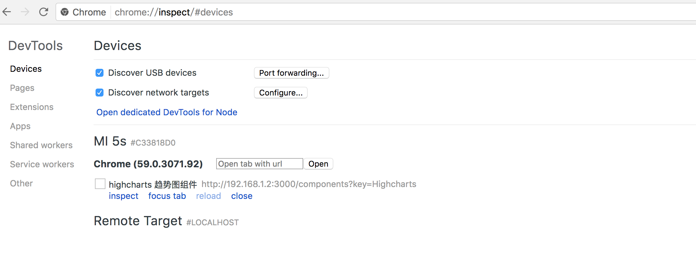
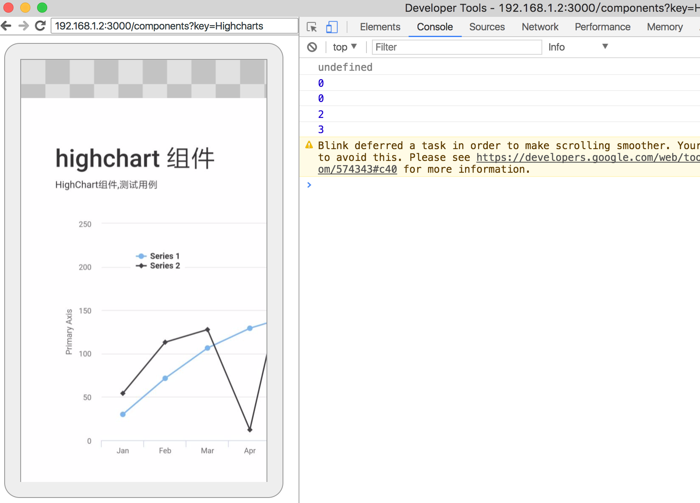

## 1、如何进行移动端开发

### 真机调试

&emsp;&emsp;做移动开发的时候大多数要跟手机界面打交道，也就是说，你只能在电脑上开发写代码，最终的效果确是在另一个终端虽然各种浏览器为开发者提供了很多模拟手机设备的功能，这些功能总体来说基本可以满足我们对于调试移动设备的需求，但是模拟终究是模拟，无法完全还原场景。所以，必须在想办法在真实的机子上测试我们的代码最终的执行效果。办法当然是有的，下面是露珠在开发过程中用到的若干真机调试方法：

#### Chrome 真机调试

&emsp;&emsp;chrome 必须有硬件的接触，
首先确保手机上和 PC 机上装有最新版本的 chrome 浏览器，然后将数据线将两台设备连接起来。在 PC 机上打开 chorme，输入 chrome://inspect,
于是你就可以看到自己的设备和打开的网页了:

&emsp;&emsp; 设备网址下出现 inspect、reload、close 等选项，点击 inspect 会弹出一个窗口，阁下就可以在窗口中愉快地去调试了。

Chrome 手机调试工具优点：

在熟悉的开发模式下调试，操作比较简单。个人觉得 UC 在这方面胜过 chrome。可以跨平台，在 ios 上也可以用。

Chrome 手机调试工具缺点：

有目共睹，比起 UC 来，它步骤比较繁琐，不能 wifi 调试，必须指定手机和 PC 浏览器的类型（都是 chrome），这种模式无法调试微信或者其他 app 内置浏览器。

#### Safari

手机端：设置 → Safari → 高级 → Web 检查器 → 开
mac 端：Safari → 偏好设置 → 高级 → 在菜单栏中显示“开发”菜单
在 OS X 中启动 Safari 之后，以 USB 电缆正常接入 iOS 设备，并在此移动设备上启动 Safari。此时点击计算机上的 Safari 菜单中的“开发”，可以看到有 iOS 设备的名称显示，其子菜单项即为移动设备上 Safari 的所有标签页，点击任意一个开始调试。
苹果系列优点：

便捷，简单，高端大气上档次，可以调试外壳包裹的浏览器如微信。

苹果系列缺点：

设备限严重依赖其公司产品。