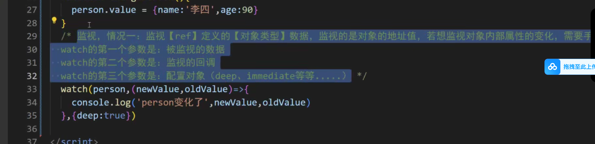

## Vue3 相关

- 1、基本类型变为响应式  ref
- 2、引用类型变为响应式 reactive
- 3、设置 setup 的name 属性，作为组件名称 插件：vite-plugin-vue-setup-extend
- 4、reactive 响应式对象，整体更新，可以利用 Object.assign(car,new1,new2)
- 5、 toRefs将reactive 对象转为 refs
- 6、toRef : 一个一个取
- 7、computed 计算属性
- 8、watch 监听，watchEffect 自动监听变化
- 9、defineExpose 暴露对象
- 10、ref 
- defineProps
- withDefaults

